# OPERATOR LOGIKA DAN PEMBANDING
## AND
### Struktur 

```mysql
SELECT nama_kolom1,nama_kolom2 FROM nama_tabel WHERE nama_kolom3="nilai_kolom1" AND nama_kolom4="nama_kolom2";
```

### Contoh

```mysql
SELECT warna_pemilik FROM desc_mobil WHERE warna="Hitam" AND pemilik="Ibrahim";
```

### Hasil

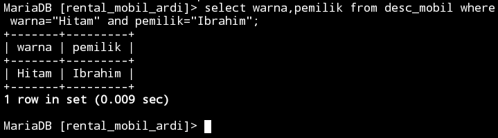

### Analisis 

Mengambil data dari tabel `desc_mobil` yang memenuhi dua kondisi: `warna` mobil adalah `Hitam` dan `pemilik` mobil adalah `Ibrahim`. Kemudian, program tersebut hanya mengambil kolom `warna_pemilik` dari hasil query. Dengan kata lain, program ini mencari mobil dengan warna hitam yang dimiliki oleh seseorang yang bernama Ibrahim.

### Kesimpulan 

Bahwa program tersebut mencari mobil dengan warna hitam yang dimiliki oleh seseorang yang bernama Ibrahim.

## OR
### Struktur 

```mysql
SELECT nama_kolom1,nama_kolom2 FROM nama_tabel WHERE nama_kolom3="nilai_kolom1" OR nama_kolom4="nama_kolom2";
```

### Contoh

```mysql
SELECT warna_pemilik FROM desc_mobil WHERE warna="Hitam" OR pemilik="Ibrahim";
```

### Hasil

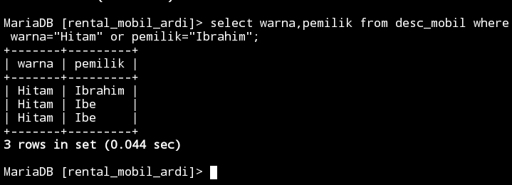

### Analisis 

Untuk mengambil data dari tabel `desc_mobil`. Pernyataan `SELECT` digunakan untuk memilih kolom `warna_pemilik` dari tabel tersebut. Kriteria seleksi ditetapkan dengan menggunakan pernyataan `WHERE`, dimana baris yang memiliki nilai `warna` sama dengan `Hitam` atau nilai `pemilik` sama dengan `Ibrahim` akan dipilih. Ini berarti program akan mengambil semua data pemilik mobil yang memiliki mobil berwarna hitam atau pemilik mobil yang bernama Ibrahim.

### Kesimpulan 

Program tersebut akan mengambil data mengenai pemilik mobil yang memiliki mobil berwarna hitam, serta data mengenai mobil yang dimiliki oleh seseorang bernama `Ibrahim`, dari tabel `desc_mobil`.

## BETWEEN-AND
### Struktur 

```mysql
SELECT * FROM nama_tabel WHERE nama_kolom BETWEEN nilai_kolom1 AND nilai_kolom2;
```

### Contoh

```mysql
SELECT * FROM desc_mobil WHERE harga_rental BETWEEN 100000 AND 200000;
```

### Hasil

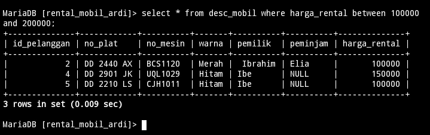

### Analisis 

Untuk mengambil semua data dari tabel `desc_mobil` di mana nilai kolom `harga_rental` berada dalam rentang antara `100000` dan `200.000`. Ini menunjukkan bahwa program tersebut bertujuan untuk mengambil semua mobil yang memiliki harga sewa di antara rentang tersebut.

### Kesimpulan 

Digunakan untuk mengekstrak data mobil-mobil yang memiliki harga sewa dalam rentang tertentu, yaitu antara `100000` dan `200000`.

## <=
### Struktur 

```mysql
SELECT * FROM nama_tabel WHERE nama_kolom <= nilai_kolom;
```

### Contoh

```mysql
SELECT * FROM desc_mobil WHERE harga_rental <= 50000;
```

### Hasil

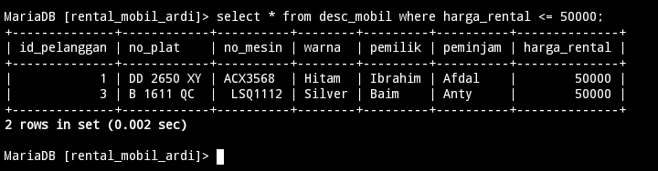

### Analisis 

Bertujuan untuk mengambil semua data dari tabel `desc_mobil` di mana harga rental mobil kurang dari atau sama dengan `50000`. Ini adalah contoh penggunaan klausa `WHERE` untuk melakukan filtering data berdasarkan kondisi tertentu. Dengan menggunakan `*`, program ini akan mengambil semua kolom yang ada dalam tabel `desc_mobil`.

### Kesimpulan 

Mengambil semua data mobil dari tabel `desc_mobil` yang memiliki harga rental kurang dari atau sama dengan `50000`.

## =>
### Struktur 

```mysql
SELECT * FROM nama_tabel WHERE nama_kolom => nilai_kolom;
```

### Contoh

```mysql
SELECT * FROM desc_mobil WHERE harga_rental => 50000;

```

### Hasil

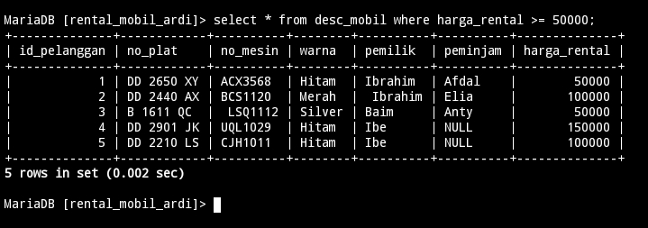

### Analisis 

Mengambil data dari tabel `desc_mobil` di mana nilai kolom `harga_rental` lebih besar dari atau sama dengan `50000`. Ini berarti program ini akan mengembalikan semua baris dari tabel `desc_mobil` di mana harga rental mobilnya setidaknya `50000` atau lebih tinggi.

### Kesimpulan 

Digunakan untuk mengambil data `desc_mobil` dari sebuah tabel di mana harga rental mobilnya setidaknya `50000` atau lebih tinggi.

## <> Atau !=
### Struktur 

```mysql
SELECT * FROM nama_tabel
WHERE nama_kolom <> nama_nilai;

```
### Contoh

```mysql
SELECT * FROM desc_mobil WHERE harga_rental <> 50000;
```

### Hasil

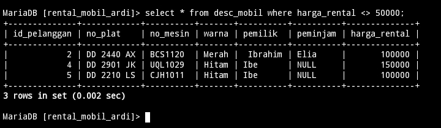

### Analisis 

Mengambil semua baris dari tabel `desc_mobil` di mana harga rental tidak sama dengan `50000`. Ini berarti hanya data mobil yang memiliki harga rental yang berbeda dari `50000` yang akan ditampilkan.

### Kesimpulan 

Bertujuan untuk memfilter data mobil dari tabel `desc_mobil` dimana harga rental tidak sama dengan `50000`.

# Tantangan
## Struktur 

```mysql
SELECT nama_kolom1 FROM nama_tabel WHERE nama_kolom2;
```

## Contoh

```mysql
SELECT nama_asli FROM akun where id_akun=1;
```

## Hasil

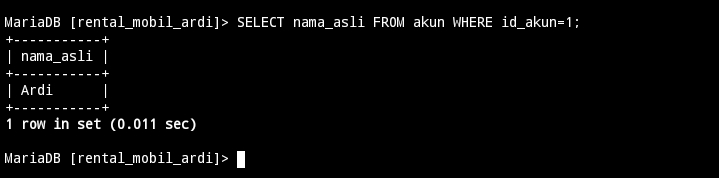

## Analisis 

- `SELECT`: Klausa yang digunakan untuk memilih data dari tabel.

- `nama_asli`: Kolom yang ingin diambil datanya.

- `FROM akun`: Menentukan tabel akun sebagai sumber data.

- `WHERE id_akun=1`: Kondisi yang harus dipenuhi untuk mengambil data, yaitu id_akun harus bernilai 1.

# IN
## IN
### Struktur 

```mysql
SELECT * FROM nama_tabel WHERE nama_kolom IN ("nilai_kolom1","nilai_kolom2");
```

### Contoh

```mysql
SELECT * FROM desc_mobil WHERE warna IN ("Silver","Merah");
```

### Hasil

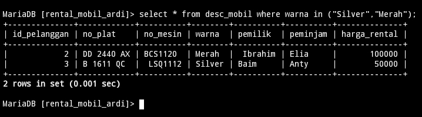

### Analisis 

Mengambil semua data dari tabel `desc_mobil` di mana `warna` mobil adalah `Silver` atau `Merah`. Ini digunakan untuk menampilkan informasi tentang mobil-mobil dengan warna tertentu dalam basis data.

### Kesimpulan 

Untuk menampilkan semua data mobil yang memiliki warna `Silver` atau `Merah` dari tabel `desc_mobil`.
 
## IN-AND
### Struktur 

```mysql
 select * from nama_tabel
where nama_kolom1 in ("nilai_kolom1","nilai_kolom2")
and nama_kolom2 = nilai_kolom3;
```

### Contoh

```mysql
 select * from desc_mobil
where warna in ("Hitam","Silver")
and harga_rental = 50000;
```

### Hasil

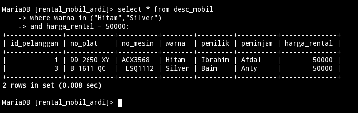

### Analisis 

Mengambil semua baris dari tabel `desc_mobil` dimana nilai kolom warna adalah `Hitam` atau `Silver` dan nilai kolom `harga_rental` adalah `50000`. Ini menunjukkan bahwa program tersebut mencari mobil dengan warna `Hitam` atau `Silver` yang memiliki harga rental sebesar `50000`.

### Kesimpulan 

Bahwa pengguna ingin mencari mobil dengan warna `Hitam` atau `Silver` yang tersedia untuk disewa dengan harga rental sebesar `50000`.

## IN-OR
### Struktur 

```mysql
 select * from nama_tabel
where nama_kolom1 in ("nilai_kolom1","nilai_kolom2")
and nama_kolom2 = nilai_kolom3;
```

### Contoh

```mysql
 select * from desc_mobil
where warna in ("Hitam","Silver")
or harga_rental = 50000;
```

### Hasil

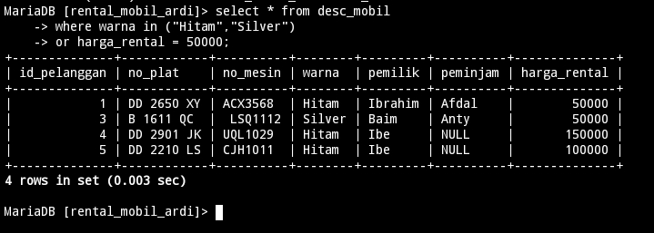

### Analisis 

Memilih semua kolom dari tabel `desc_mobil` dimana nilai kolom `warna` adalah `Hitam` atau `Silver`, atau nilai kolom `harga_rental` adalah `50000`. Ini akan mengembalikan baris-baris dari tabel `desc_mobil` yang memenuhi salah satu dari kondisi tersebut.

### Kesimpulan

Mengambil data dari tabel desc_mobil yang memiliki warna mobil `Hitam` atau `Silver`, atau memiliki harga rental sebesar `50000`.

## IN-AND-OPERATOR 
### Struktur 

```mysql
 select * from nama_tabel
where nama_kolom1 in ("nilai_kolom1","nilai_kolom2")
and nama_kolom2 > nilai_kolom3;
```

```mysql
 select * from nama_tabel
where nama_kolom1 in ("nilai_kolom1","nilai_kolom2")
and nama_kolom2 < nilai_kolom3;
```

### Contoh

```mysql
 select * from desc_mobil
where warna in ("Hitam","Silver")
and harga_rental > 50000;
```

```mysql
 select * from desc_mobil
where warna in ("Hitam","Silver")
and harga_rental < 100000;
```

### Hasil

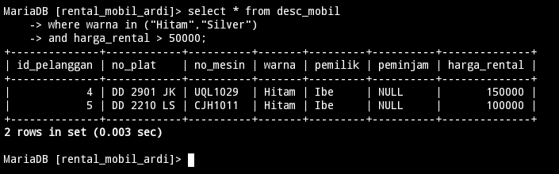

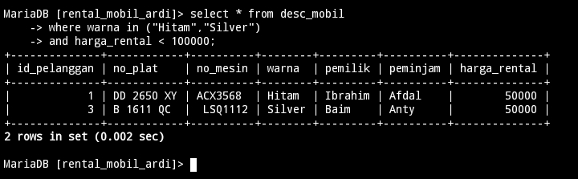

### Analisis 

Mengambil data dari tabel `desc_mobil` dimana nilai kolom `warna` adalah `Hitam` atau `Silver`, dan nilai kolom `harga_rental` lebih besar dari `50000`. Analisisnya menunjukkan bahwa program ini bertujuan untuk menampilkan informasi tentang mobil-mobil dengan warna `Hitam` atau `Silver` yang memiliki harga rental lebih dari `50000`.

Bertujuan untuk menampilkan semua data dari tabel `desc_mobil` dimana `warna` mobil adalah `hitam` atau `silver`, dan harga rentalnya kurang dari `100000`. Ini menunjukkan bahwa pengguna tertarik untuk melihat mobil dengan warna tertentu yang juga memiliki harga sewa yang terjangkau.

### Kesimpulan 

Digunakan untuk mencari mobil-mobil dengan warna `Hitam` atau `Silver` yang memiliki harga rental lebih dari `50000` dalam tabel `desc_mobil`.

Mencari mobil dengan warna `hitam` atau `silver` dan harga sewa di bawah `100000`.

# LIKE
## Mencari awalan
### Struktur 

```mysql
  select * from nama_tabel
where nana_kolom like "nilai_kolom";
```

### Contoh

```mysql
  select * from desc_mobil
where pemilik like "Ib%";
```

### Hasil

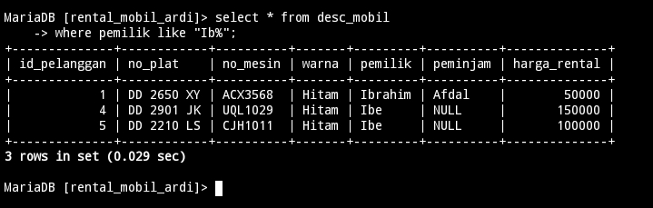

### Analisis 

Mengambil semua kolom dari tabel `desc_mobil` di mana nilai kolom `pemilik` dimulai dengan `Ib`. Ini adalah contoh penggunaan wildcard (`%`) dalam SQL untuk mencocokkan pola tertentu dari nilai kolom. Dalam hal ini, kita mencari pemilik mobil yang namanya dimulai dengan `Ib`.

### Kesimpulan 

Digunakan untuk mengambil data dari tabel `desc_mobil` di mana pemilik mobil memiliki nama yang dimulai dengan `Ib`.

## Mencari akhiran
### Struktur 

```mysql
  select * from nama_tabel
where nana_kolom like "nilai_kolom";
```

### Contoh

```mysql
  select * from desc_mobil
where pemilik like "%m";
```

### Hasil

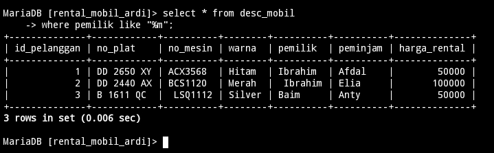

### Analisis 

Melakukan seleksi dari tabel `desc_mobil` dimana nilai kolom `pemilik` berakhir dengan huruf `m`. Ini akan mengembalikan semua baris dalam tabel `desc_mobil` dimana nama pemilik mobil diakhiri dengan huruf `m`.

### Kesimpulan 

digunakan untuk mengambil data dari tabel `desc_mobil` dimana nama pemilik mobil diakhiri dengan huruf `m`.

## Mencari awalan & akhiran
### Struktur 

```mysql
  select * from nama_tabel
where nama_kolom like "nilai_kolom";
```

### Contoh

```mysql
  select * from desc_mobil
where pemilik like "b%m";
```

### Hasil

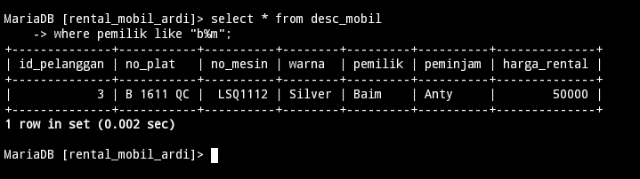

### Analisis 

Mengambil semua data dari tabel `desc_mobil` di mana nilai kolom `pemilik` dimulai dengan huruf 'b' dan diikuti dengan huruf 'm'. Tanda '%' dalam kondisi `LIKE` merupakan wildcard yang akan cocok dengan nol atau lebih karakter apa pun. Jadi, program ini akan mengembalikan semua baris di mana nilai kolom `pemilik` dimulai dengan 'b' dan diikuti oleh 'm'.

### Kesimpulan 

mengambil semua entri dari tabel `desc_mobil` di mana nama pemilik mobil dimulai dengan huruf `b` dan diikuti oleh huruf `m`.

## Kombinasi 
### Struktur 

```mysql
  select * from nama_tabel
where nama_kolom like "nilai_kolom";
```

```mysql
  select * from nama_tabel
where nama_kolom like "nilai_kolom";
```

### Contoh

```mysql
  select * from desc_mobil
where pemilik like "__I%";
```

```mysql
  select * from desc_mobil
where pemilik like "_b%";
```

### Hasil

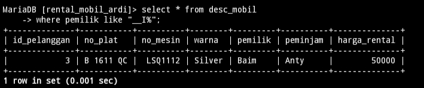

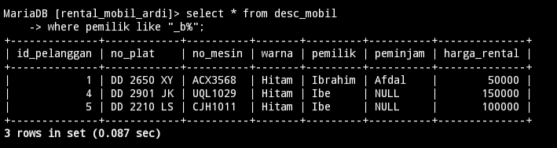

### Analisis 

Mengambil semua kolom dari tabel `desc_mobil` di mana nilai dalam kolom pemilik dimulai dengan dua karakter, diikuti oleh huruf `I`. dan kemudian karakter apa pun. Ini akan mengembalikan semua baris di mana pemilik mobil memiliki nama yang dimulai dengan `I`.

Mengambil semua data dari tabel `desc_mobil` dimana nilai kolom pemilik dimulai dengan huruf kedua `b` (huruf pertama bisa apa saja karena disimbolkan dengan _ ). Ini akan mengembalikan semua entri yang memiliki pemilik dengan awalan `b`.

### Kesimpulan 

Mengambil data dari tabel `desc_mobil` dimana pemilik mobil memiliki nama yang dimulai dengan huruf `I`.

Mengambil semua entri dari tabel `desc_mobil` dimana nama pemilik mobil dimulai dengan huruf `b` di posisi kedua. Ini dapat berguna untuk mengekstrak data terkait mobil yang dimiliki oleh pemilik dengan nama yang dimulai dengan huruf `b`.

## NOT LIKE
### Struktur 

```mysql
select * from nama_tabel where nama_kolom not like "nilai_kolom";
```

### Contoh

```mysql

select * from desc_mobil where peminjam not like "A%";
```

### Hasil

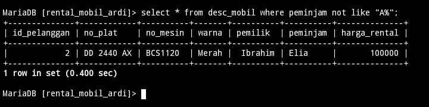

### Analisis 

Melakukan pemilihan semua baris dari tabel `desc_mobil` di mana nilai kolom peminjam tidak dimulai dengan huruf `A`. Dengan kata lain, program ini akan mengembalikan semua catatan tentang mobil yang tidak dipinjam oleh seseorang yang namanya dimulai dengan huruf `A`.

### Kesimpulan 

Bertujuan untuk mengambil data dari tabel `desc_mobil` di mana mobil-mobil tersebut tidak dipinjam oleh peminjam yang namanya dimulai dengan huruf `A`.

# NULL & NOT
## Struktur 

```mysql
select distinct(nama_kolom) from nama_tabel;
```

```mysql
select distinct(nama_kolom) from nama_tabel order by nama_kolom desc;
```

## Contoh

```mysql
select distinct(pemilik) from desc_mobil;
```

```mysql
select distinct(harga_rental) from desc_mobil order by harga_rental desc;
```

## Hasil

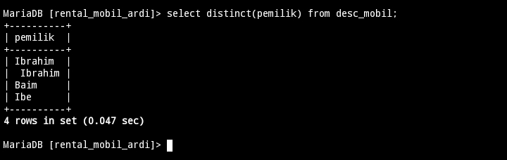

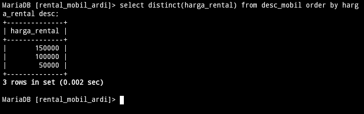

## Analisis 

`SELECT DISTINCT(pemilik) FROM desc_mobil;`, digunakan untuk mengambil nilai unik dari kolom 'pemilik' dalam tabel `desc_mobil`. Ini akan menghasilkan daftar pemilik mobil yang berbeda tanpa ada duplikasi.

Mengambil nilai unik dari kolom `harga_rental` dari tabel `desc_mobil`, kemudian mengurutkannya secara descending (menurun). Dengan kata lain, program ini akan menampilkan daftar harga rental mobil tanpa ada nilai yang berulang, dan disusun dari harga yang tertinggi ke terendah.

## Kesimpulan 

Digunakan untuk menghasilkan daftar unik dari pemilik mobil yang terdaftar dalam tabel `desc_mobil`.

Memberikan daftar harga rental mobil yang unik dan diurutkan dari yang tertinggi ke terendah, sehingga memudahkan dalam memahami variasi `harga rental` mobil yang ada dalam database.

# ORDER BY & LIMIT
## Mengurutkan data dari data terkecil 
### Struktur 

```mysql
SELECT * FROM nama_tabel ORDER BY nama_kolom ASC;
```

### Contoh

```mysql
SELECT * FROM desc_mobil ORDER BY pemilik ASC;
```

### Hasil

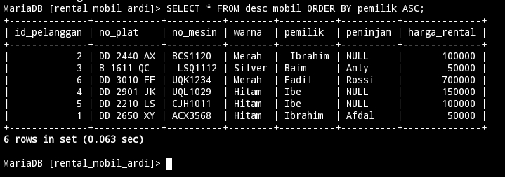

### Analisis 

1. **Pengambilan Data:**
   - `SELECT *` mengambil semua kolom dari tabel `desc_mobil`.

2. **Pengurutan Data:**
   - `ORDER BY pemilik ASC` mengurutkan hasil berdasarkan kolom `pemilik` secara alfabetis.

3. **Kegunaan:**
   - Berguna untuk melihat daftar mobil yang diurutkan berdasarkan nama pemilik.

4. **Efisiensi:**
   - Pengurutan bisa lambat jika tabel besar; indeks pada kolom `pemilik` bisa mempercepatnya.
   
### Kesimpulan 

1. **Fungsi Utama:** Mengambil semua data dari tabel `desc_mobil` dan mengurutkannya berdasarkan nama pemilik dalam urutan menaik.
2. **Keuntungan:** Memudahkan pencarian dan penampilan data mobil berdasarkan pemilik.
3. **Efisiensi:** Dapat ditingkatkan dengan mengindeks kolom `pemilik` dan hanya memilih kolom yang diperlukan untuk mengurangi beban pemrosesan.

## Mengurutkan data dari data terbesar 
### Struktur 

```mysql
SELECT * FROM nama_tabel ORDER BY nama_kolom DESC;
```

### Contoh

```mysql
SELECT * FROM desc_mobil ORDER BY pemilik DESC;
```

### Hasil

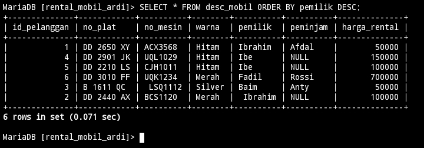

### Analisis 

- SELECT : Bagian ini berarti memilih semua kolom dari tabel desc_mobil.
- FROM desc_mobil: Bagian ini menentukan tabel yang akan diambil datanya, yaitu desc_mobil.
- ORDER BY pemilik DESC: Bagian ini mengurutkan hasil query berdasarkan kolom pemilik dalam urutan menurun.

### Kesimpulan 

Mengambil semua data dari tabel `desc_mobil` dan mengurutkannya berdasarkan kolom pemilik dalam urutan menurun. Ini berguna untuk melihat data dengan urutan dari nilai terbesar ke terkecil di kolom `pemilik`, tetapi kinerjanya dapat terpengaruh jika tabel besar atau kolom memiliki banyak nilai yang sama.

## Limit
### Struktur 

```mysql
SELECT * FROM nama_tabel WHERE nama_kolom1 = "nilai_kolom1" ORDER BY nama_kolom2  ASC LIMIT nilai_kolom2;
```


### Contoh

```mysql
SELECT * FROM desc_mobil WHERE warna = "Hitam" ORDER BY harga_rental  ASC LIMIT 2;
```

### Hasil

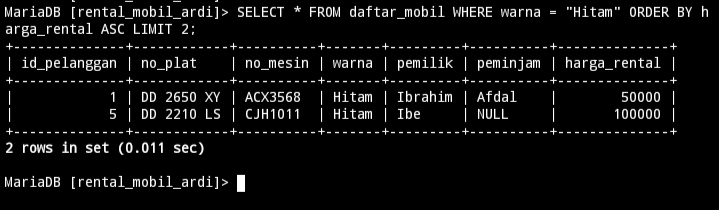

### Analisis 

1. **Tabel**: Query ini mengambil data dari tabel `desc_mobil`.

2. **Kondisi**: Filter yang digunakan adalah `warna = "Hitam"`, yang berarti hanya mobil dengan warna hitam yang akan diambil datanya.

3. **Pengurutan**: Data yang sudah difilter akan diurutkan berdasarkan kolom `harga_rental` secara ascending (dari yang termurah ke yang termahal).

4. **Pembatasan Hasil**: Query ini hanya mengambil dua baris pertama dari hasil yang sudah difilter dan diurutkan tersebut (`LIMIT 2`).

### Kesimpulan 

Query ini mencari dua mobil berwarna hitam dengan harga rental termurah dari tabel `desc_mobil`.

# DISTINCT
## Struktur 

```mysql
SELECT DISTINCT(nama_kolom) FROM nama_tabel;
```

```mysql
SELECT DISTINCT(nama_kolom) FROM nama_tabel ORDER BY nama_kolom desc;
```

## Contoh 

```mysql
SELECT DISTINCT(pemilik) FROM desc_mobil;
```

```mysql
SELECT DISTINCT(harga_rental) FROM desc_mobil ORDER BY harga_rental desc;
```

## Hasil


## Analisis 

1. **Tujuan**: Perintah ini bertujuan untuk mengidentifikasi semua pemilik yang berbeda dari data mobil yang terdapat dalam tabel `desc_mobil`.

2. **Fungsi DISTINCT**: Kata kunci `DISTINCT` digunakan untuk memastikan bahwa hasil yang diambil tidak mengandung duplikat. Dengan kata lain, setiap pemilik yang muncul lebih dari sekali dalam tabel akan hanya muncul sekali dalam hasil.

3. **Kolom yang Dipilih**: Hanya kolom `pemilik` yang dipilih dalam query ini. Tidak ada kolom lain yang diambil.

4. **Penggunaan**: Query semacam ini berguna untuk menganalisis atau melaporkan data unik terkait pemilik mobil, misalnya untuk membuat daftar pemilik tanpa ada pengulangan nama.

5. **Konteks**: Dalam konteks basis data yang lebih luas, query ini bisa digunakan untuk memahami distribusi kepemilikan mobil, misalnya untuk analisis pelanggan atau pengguna jasa.
---------------------------------
1. **SELECT DISTINCT(harga_rental)**: Bagian ini memilih harga rental (`harga_rental`) dari tabel `desc_mobil` dan memastikan bahwa setiap nilai harga yang diambil adalah unik, tanpa ada duplikasi.

2. **FROM desc_mobil**: Bagian ini menunjukkan tabel dari mana data diambil, yaitu `desc_mobil`.

3. **ORDER BY harga_rental desc**: Bagian ini mengurutkan hasil yang diambil berdasarkan nilai `harga_rental` secara menurun (dari yang tertinggi ke yang terendah).

## Kesimpulan 
 
`SELECT DISTINCT(pemilik) FROM desc_mobil;` berfungsi untuk mengambil daftar unik dari semua pemilik yang tercatat dalam tabel `desc_mobil`, memastikan bahwa setiap pemilik hanya muncul sekali dalam hasil.

bertujuan untuk menghasilkan daftar harga rental mobil yang unik dari tabel `desc_mobil`, disusun secara menurun dari harga tertinggi ke terendah. Hal ini bermanfaat untuk analisis harga dan pemahaman rentang harga yang tersedia dalam data rental mobil.
# CONCAT, CONCAT_WS, AS
## Menggabungkan kolom tanpa pemisah
### Struktur 

```mysql
select concat (nama_kolom1,nama_kolom2) from nama_tabel;
```

### Contoh 

```mysql
select concat (pemilik,warna) from desc_mobil;
```

### Hasil

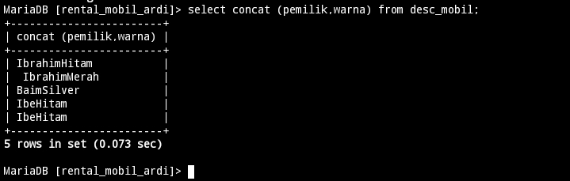

### Analisis 

Melakukan pengambilan data dari tabel `desc_mobil` dan menggabungkan nilai dari kolom `pemilik` dengan nilai dari kolom `warna` menggunakan fungsi `concat()`. Hasilnya adalah penggabungan dari nilai kedua kolom tersebut menjadi satu string untuk setiap baris dalam tabel `desc_mobil`.

### Kesimpulan 

Menghasilkan string yang merupakan gabungan antara nilai dari kolom `pemilik` dan kolom `warna` untuk setiap baris dalam tabel `desc_mobil`.

## Menggabungkan kolom dengan pemisah
### Struktur 

```mysql
SELECT CONCAT_WS("_",nama_kolom1,nama_kolom2,nama_kolom3) FROM nama_tabel;
```

### Contoh

```mysql
SELECT CONCAT_WS("-",no_plat,no_mesin,id_pelanggan) FROM desc_mobil;
```

### Hasil

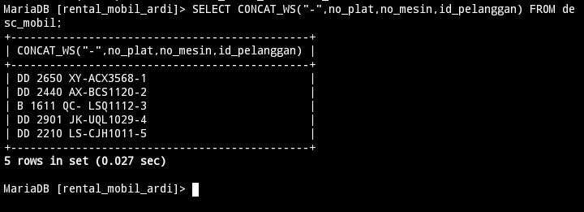

### Analisis 

Menggabungkan nilai-nilai dari kolom-kolom tertentu dalam tabel `desc_mobil` menggunakan fungsi `CONCAT_WS`. Fungsi `CONCAT_WS` digunakan untuk menggabungkan beberapa string dengan menambahkan separator di antara mereka. Dalam hal ini, string-string yang digabungkan adalah `no_plat`, `no_mesin`, dan `id_pelanggan`, dipisahkan oleh tanda `-`. Hasilnya adalah gabungan nilai-nilai tersebut dalam format yang dipisahkan oleh tanda `-`.

### Kesimpulan 

Menghasilkan string baru yang merupakan gabungan dari nomor plat, nomor mesin, dan ID pelanggan dari tabel `desc_mobil`, dengan setiap nilai dipisahkan oleh tanda `"-"`.

## Memberikan nama kolom alias
### Struktur 

```mysql
SELECT CONCAT_WS("_",nama_kolom1, nama_kolom2) AS nama_kolom3 FROM nama_tabel;
```

### Contoh

```mysql
SELECT CONCAT_WS("+",pemilik, peminjam) AS COLLAB FROM desc_mobil;
```

### Hasil

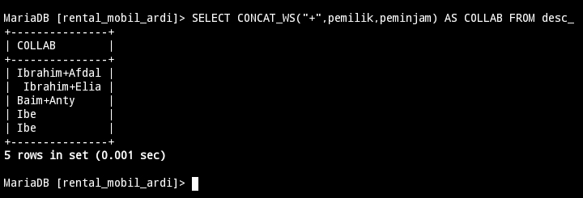

### Analisis 

Mengambil data dari tabel `desc_mobil` dan menggunakan fungsi `CONCAT_WS()` untuk menggabungkan nilai dari kolom pemilik dan peminjam, dengan tanda tambah `"+"` di antara keduanya. Hasilnya adalah kolom baru yang disebut `COLLAB`, yang berisi gabungan nama pemilik dan peminjam, dipisahkan oleh tanda tambah.

### Kesimpulan 

Menghasilkan kolom baru yang menggabungkan nama `pemilik` dan `peminjam` mobil, dipisahkan oleh tanda tambah.

# VIEW
## Membuat tabel virtual
### Struktur 

```mysql
CREATE VIEW nama_tabel AS
 SELECT nama_kolom1,nama_kolom2,nama_kolom3,nama_kolom4 
  FROM nama_tabel
 WHERE nama_kolom5 = "nilai_kolom";
```

### Contoh

```mysql
CREATE VIEW info_no_plat AS
 SELECT id_pelanggan,no_plat,pemilik,peminjam 
  FROM daftar_mobil
 WHERE pemilik = "Ibrahim";
```

### Hasil

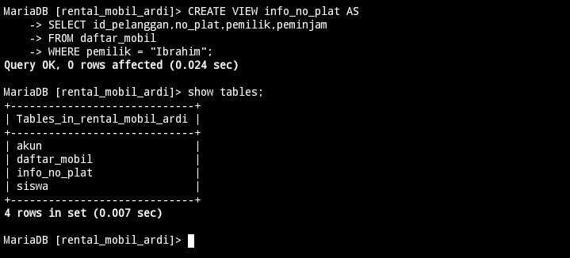

### Analisis 

Membuat sebuah view yang disebut `info_no_plat` yang berisi informasi tentang nomor plat mobil yang dimiliki oleh pemilik bernama Ibrahim. View ini akan menampilkan kolom `id_pelanggan`, `no_plat`, `pemilik`, dan `peminjam` dari tabel `daftar_mobil`, tetapi hanya baris-baris di mana pemilik mobil adalah "Ibrahim". Dengan demikian, view ini akan memberikan informasi terkait mobil-mobil yang dimiliki oleh Ibrahim.

### Kesimpulan 

Membuat sebuah view yang memfilter data dari tabel `daftar_mobil` untuk menampilkan informasi hanya tentang mobil-mobil yang dimiliki oleh `pemilik` dengan nama `Ibrahim`.

## Menampilkan tabel virtual
### Struktur 

```mysql
select * from nama_tabel;
```

### Contoh 

```mysql
select * from info_no_plat;
```

### Hasil

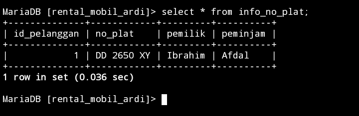

### Analisis 

Untuk mengambil semua data dari tabel bernama `info_no_plat`. Dengan perintah `SELECT *`, program akan mengambil semua kolom yang ada di tabel tersebut.

### Kesimpulan 

digunakan untuk mengambil semua data dari tabel `info_no_plat`. Tujuan utamanya adalah untuk mengakses informasi yang tersimpan dalam tabel tersebut.

## Menghapus tabel virtual 
### Struktur 

```mysql
DROP VIEW nama_tabel;
```

### Contoh

```mysql
DROP VIEW info_no_plat;
```

### Hasil

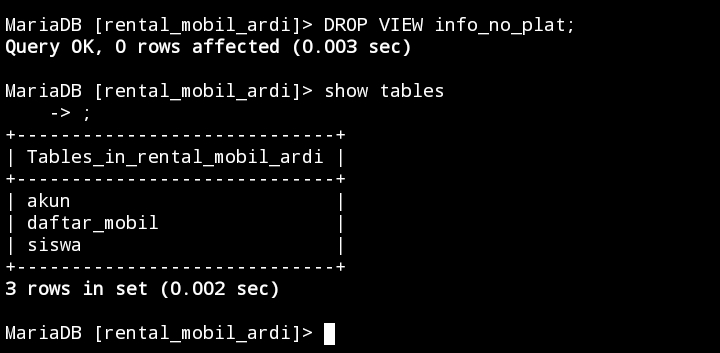

### Analisis 

`DROP VIEW` digunakan untuk menghapus sebuah view dari database. Dalam hal ini, `info_no_plat` adalah nama `view` yang akan dihapus.

### Kesimpulan 

`DROP VIEW info_no_plat;` akan menghapus view dengan nama `info_no_plat` dari database.


# Tantangan 
## Tantangan 1
### query

```mysql
CREATE VIEW peminjam_NULL AS SELECT id_pelanggan,no_plat,peminjam,harga_rental FROM desc_mobil WHERE peminjam IS NULL;
```

### Hasil

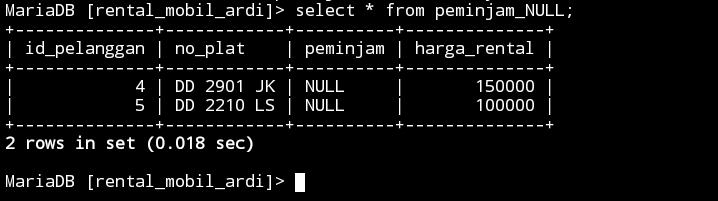

## Tantangan 2
### query

```mysql
UPDATE desc_mobil SET peminjam=NULL WHERE id_pelanggan=2;
```

### Hasil

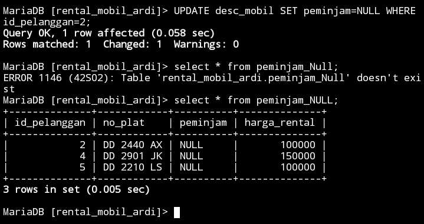

## Tantangan 3

>[!Tantangan3]-
>Tabel Virtual ini dibuat untuk menyediakan informasi tentang mobil yang saat ini tidak dipinjam (peminjamnya NULL), sehingga memudahkan pengelolaan dan pelacakan mobil yang tersedia untuk disewakan. Dengan demikian, orang dapat dengan mudah melihat daftar mobil yang tersedia untuk disewa tanpa harus memeriksa satu per satu dalam database.

# AGREGASI 
## Menghitung total nilai numerik suatu kolom
### Struktur 

```mysql
SELECT SUM(nama_kolom1) AS nama_kolom2 FROM nama_tabel;
```

### Contoh

```mysql
SELECT SUM(harga_rental) AS total_harga FROM daftar_mobil;
```

### Hasil

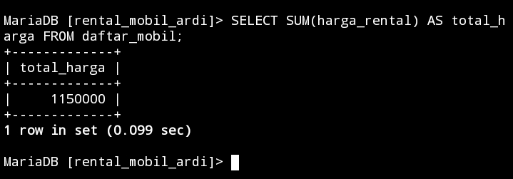

### Analisis 

Melakukan pengambilan total harga rental dari tabel `daftar_mobil` dengan menggunakan fungsi agregat `SUM()` untuk menjumlahkan nilai dari kolom `harga_rental`. Ini akan menghasilkan satu baris output yang berisi total harga rental dari semua mobil yang terdaftar dalam tabel tersebut.

### Kesimpulan 

Menghitung total `harga rental` dari semua mobil yang terdaftar dalam tabel `daftar_mobil`. Dengan menggunakan fungsi agregat `SUM()`, program ini memungkinkan untuk dengan cepat dan mudah mendapatkan informasi tentang total pengeluaran untuk rental mobil yang tercatat dalam database.

## Menghitung jumlah baris/data, biasanya berdasarkan kriteria tertentu
### Struktur 

```mysql
SELECT COUNT(nama_kolom1) AS nama_kolom2 FROM nama_tabel;
```

```mysql
SELECT COUNT(nama_kolom1) AS nama_kolom2 FROM nama_tabel;
```


### Contoh

```mysql
SELECT COUNT(pemilik) AS total_pemilik FROM daftar_mobil;
```

```mysql
SELECT COUNT(peminjam) AS total_peminjam FROM daftar_mobil;
```

### Hasil

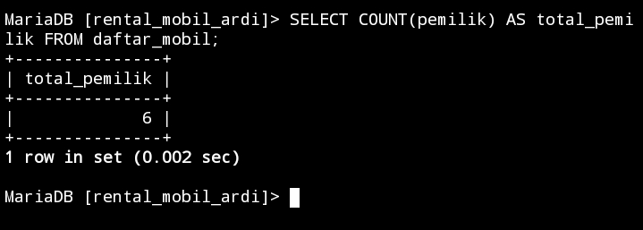

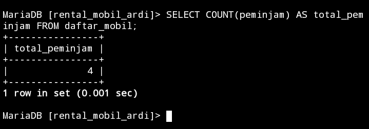

### Analisis 

 `SELECT COUNT(pemilik) AS total_pemilik FROM daftar_mobil;`, menghitung jumlah baris dalam tabel `daftar_mobil` di mana kolom `pemilik` tidak null. Hasilnya adalah total jumlah pemilik mobil yang terdaftar dalam tabel `daftar_mobil`.

Melakukan penghitungan jumlah peminjam dalam tabel `daftar_mobil` dan memberikan hasilnya dalam kolom yang dinamai `total_peminjam`.

### Kesimpulan 

Kesimpulannya, digunakan untuk menghitung jumlah pemilik mobil yang terdaftar dalam tabel `daftar_mobil`.

Digunakan untuk menghitung total jumlah peminjam mobil dari tabel `daftar_mobil`, yang dapat memberikan pemahaman tentang tingkat popularitas atau penggunaan mobil-mobil tersebut dalam periode waktu tertentu.

## Menampilkan nilai terendah
### Struktur 

```mysql
SELECT MIN(nama_kolom1) AS nama_kolom2 FROM nama_tabel;
```

### Contoh

```mysql
SELECT MIN(harga_rental) AS minimum FROM daftar_mobil;
```

### Hasil

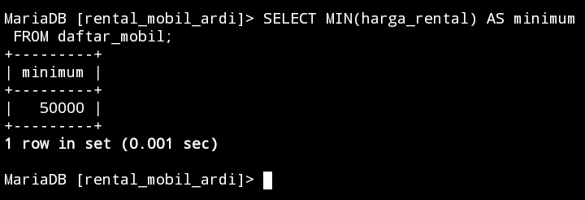

### Analisis 

Mengambil nilai terkecil dari kolom `harga_rental` dari tabel `daftar_mobil` dan memberikan hasilnya sebagai kolom yang diberi nama `minimum`. Dengan kata lain, program ini akan menampilkan harga rental mobil terendah yang terdaftar dalam tabel `daftar_mobil`. 

### Kesimpulan 

Menemukan harga rental mobil terendah yang terdaftar dalam tabel `daftar_mobil` dengan menggunakan fungsi `MIN()` pada kolom `harga_rental`. 

## Menampilkan nilai tertinggi
### Struktur 

```mysql
SELECT MAX(nama_kolom1) AS nama_kolom2 FROM nama_tabel;
```

### Contoh

```mysql
SELECT MAX(harga_rental) AS maximum FROM daftar_mobil;
```

### Hasil

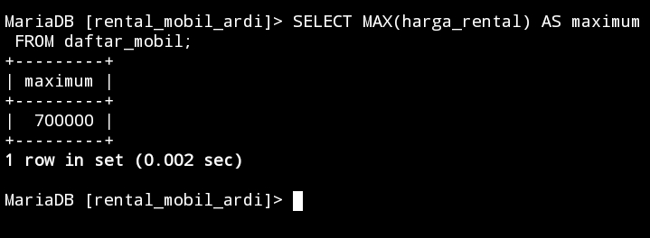

### Analisis 

Mengambil nilai maksimum dari kolom `harga_rental` dari tabel `daftar_mobil` dan memberikan label 'maximum' pada hasilnya. Ini akan mengembalikan satu baris dengan nilai maksimum dari kolom tersebut. Itu bisa digunakan untuk mengetahui mobil mana yang memiliki harga rental tertinggi dalam daftar.

### Kesimpulan 

Digunakan untuk mencari nilai maksimum dari kolom `harga_rental` dalam tabel `daftar_mobil`, yang dapat memberikan informasi tentang mobil mana yang memiliki `harga rental` tertinggi dalam daftar tersebut.

## Menampilkan nilai rata-rata
### Struktur 

```mysql
SELECT AVG(nama_kolom1) AS nama_kolom2 FROM nama_tabel;
```


### Contoh

```mysql
SELECT AVG(harga_rental) AS rerata FROM daftar_mobil;
```

### Hasil

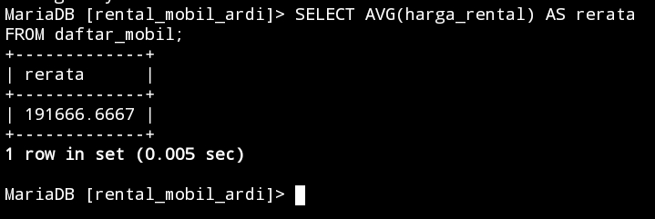

### Analisis 

Menghitung rata-rata harga rental dari tabel `daftar_mobil` dan memberikan hasilnya dengan nama kolom `rerata`. Ini bermanfaat untuk melihat nilai rata-rata dari harga rental mobil yang terdaftar dalam database.

### Kesimpulan 

Kesimpulannya, memberikan informasi tentang rata-rata harga rental mobil dari tabel `daftar_mobil`, yang dapat digunakan untuk analisis biaya sewa mobil secara keseluruhan.

# GROUP BY AND HAVING

## 1. Tampilkan jumlah data mobil dan kelompok kan berdasarkan warna nya sesuai dengan tabel mobil kalian.
### Struktur 

```mysql
select nama_kolom,COUNT(nama_kolom) AS nama_sementara FROM nama_tabel GROUP BY nama_kolom;
```

### Contoh

```mysql
select warna,COUNT(id_pelanggan) AS Jumlah_Data_Mobil FROM desc_mobil GROUP BY warna;
```

### Hasil

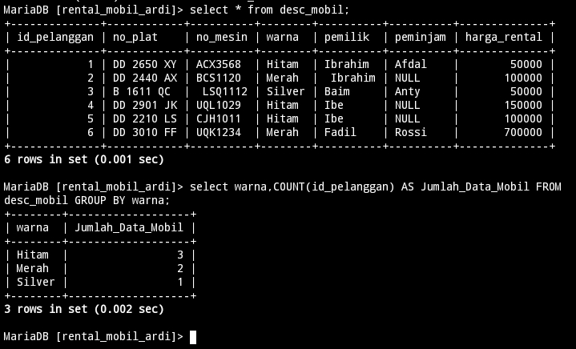

### Analisis 

1. **Fungsi Query:**
   - Mengelompokkan data mobil berdasarkan warna.
   - Menghitung jumlah entri pelanggan untuk setiap warna mobil.

2. **Komponen Utama:**
   - `SELECT warna`: Memilih kolom `warna`.
   - `COUNT(id_pelanggan) AS Jumlah_Data_Mobil`: Menghitung jumlah data untuk setiap warna.
   - `FROM desc_mobil`: Mengambil data dari tabel `desc_mobil`.
   - `GROUP BY warna`: Mengelompokkan hasil berdasarkan warna.

3. **Tujuan:**
   - Mengetahui jumlah mobil untuk setiap warna yang ada di dataset.

4. **Kegunaan Hasil:**
   - Mengetahui distribusi warna mobil.
   - Mengidentifikasi warna mobil yang paling populer dan paling jarang.
   - Membantu dalam keputusan manajemen stok dan strategi pemasaran berdasarkan preferensi warna pelanggan.

### Kesimpulan 

Memberikan wawasan berharga untuk pengambilan keputusan bisnis terkait distribusi warna mobil, preferensi pelanggan, dan strategi pemasaran serta manajemen stok.

## 2. Berdasarkan query ini tampilkan yang lebih BESAR dari 3 atau sama dengan 3 pemilik mobil nya
### Struktur 

```mysql
select nama_kolom,COUNT(nama_kolom) AS nama_sementara from nama_tabel GROUP BY nama_kolom HAVING COUNT(nama_kolom) >= nilai_kolom;
```

### Contoh

```mysql
select pemilik,COUNT(id_pelanggan) AS jumlah_mobil from desc_mobil GROUP BY pemilik HAVING COUNT(id_pelanggan) >= 2;
```

### Hasil

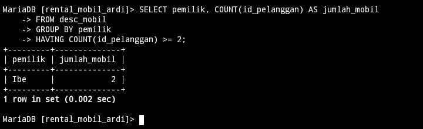

### Analisis 

1. **Fungsi Query:**
   - Mengidentifikasi pemilik yang memiliki dua mobil atau lebih.

2. **Komponen Utama:**
   - `SELECT pemilik`: Memilih kolom pemilik.
   - `COUNT(id_pelanggan) AS jumlah_mobil`: Menghitung jumlah mobil per pemilik.
   - `GROUP BY pemilik`: Mengelompokkan data berdasarkan pemilik.
   - `HAVING COUNT(id_pelanggan) >= 2`: Menyaring hasil untuk pemilik dengan minimal dua mobil.

3. **Tujuan:**
   - Menemukan dan menghitung pemilik yang memiliki lebih dari satu mobil.

### Kesimpulan 

Query ini membantu mengidentifikasi pemilik yang memiliki setidaknya dua mobil, memberikan wawasan tentang pola kepemilikan kendaraan yang lebih dari satu oleh individu atau entitas tertentu dalam dataset.

## 3. Tampilkan semua pemilik dengan jumlah mobilnya yang memiliki atau sama dengan 3 mobil
### Struktur 

```mysql
SELECT nama_kolom,COUNT(nama_kolom) AS nama_sementara FROM nama_tabel GROUP BY nama_kolom;
```

### Contoh

```mysql
SELECT pemilik, 
COUNT(id_pelanggan) AS jumlah_mobil 
FROM desc_mobil GROUP BY pemilik;
```

### Hasil 

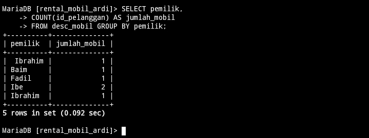

### Analisis 

1. **Fungsi Query:**
   - Mengelompokkan data berdasarkan pemilik dan menghitung jumlah mobil yang dimiliki oleh setiap pemilik.

2. **Komponen Utama:**
   - `SELECT pemilik`: Memilih kolom pemilik.
   - `COUNT(id_pelanggan) AS jumlah_mobil`: Menghitung jumlah entri (mobil) yang dimiliki oleh setiap pemilik.
   - `FROM desc_mobil`: Menunjukkan tabel sumber data.
   - `GROUP BY pemilik`: Mengelompokkan hasil berdasarkan pemilik.

3. **Tujuan:**
   - Mengetahui jumlah mobil yang dimiliki oleh setiap pemilik dalam dataset.

### Kesimpulan 

Query ini memberikan informasi tentang jumlah mobil yang dimiliki oleh masing-masing pemilik, membantu memahami distribusi kepemilikan mobil dalam dataset.

## 4. Berdasarkan query yang ada pada praktikum 5 bagian 7 tampilkan data pada table mobil dengan mengelompokkan berdasarkan pemiliknya.hitung menggunakan sum total pendapatan pemilik berdasarkan harga rental
### Struktur 

```mysql
select nama_kolom,SUM(nama_kolom) AS nama_sementara from nama_tabel GROUP BY nama_kolom;
```

### Contoh

```mysql
select pemilik,SUM(harga_rental) AS jumlah_pendapatan from desc_mobil GROUP BY pemilik;
```

### Hasil

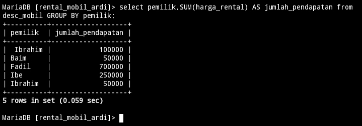

### Analisis 

1. **Fungsi Query:**
   - Mengelompokkan data berdasarkan pemilik dan menghitung total pendapatan dari harga rental untuk setiap pemilik.

2. **Komponen Utama:**
   - `SELECT pemilik`: Memilih kolom pemilik.
   - `SUM(harga_rental) AS jumlah_pendapatan`: Menjumlahkan nilai `harga_rental` untuk setiap pemilik dan memberikan alias hasil sebagai `jumlah_pendapatan`.
   - `FROM desc_mobil`: Menunjukkan tabel sumber data.
   - `GROUP BY pemilik`: Mengelompokkan hasil berdasarkan pemilik.

3. **Tujuan:**
   - Mengetahui total pendapatan dari rental mobil yang diperoleh oleh setiap pemilik dalam dataset.

### Kesimpulan 

Query ini memberikan informasi tentang total pendapatan yang diperoleh setiap pemilik dari rental mobil, membantu memahami kontribusi pendapatan per pemilik dalam dataset.

## 5. Berdasarkan praktikum 5 query no 8 tampilkan jumlah pemasukan pemilik berdasarkan harga rental kelompokkan berdasarkan pemiliknya dan seleksi yang total pemasukannya atau harga rentalnya mencapai lebih besar atau sama dengan 300k
### Struktur 

```mysql
select nama_kolom,SUM(nama_kolom) AS nama_sementara from nama_tabel GROUP BY nama_kolom HAVING SUM(nama_kolom) >= nilai_kolom;
```

### Contoh

```mysql
select pemilik,SUM(harga_rental) AS jumlah_pemasukan from desc_mobil GROUP BY pemilik HAVING SUM(harga_rental) >= 300000;
```

### Hasil

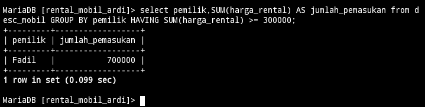

### Analisis 

1. **Fungsi Query:**
   - Mengelompokkan data berdasarkan pemilik.
   - Menghitung total pemasukan dari harga rental untuk setiap pemilik.
   - Memfilter hanya pemilik yang memiliki total pemasukan dari rental mobil minimal 300,000.

2. **Komponen Utama:**
   - `SELECT pemilik`: Memilih kolom `pemilik`.
   - `SUM(harga_rental) AS jumlah_pemasukan`: Menghitung total harga rental untuk setiap pemilik dan memberikan alias sebagai `jumlah_pemasukan`.
   - `FROM desc_mobil`: Menunjukkan tabel sumber data.
   - `GROUP BY pemilik`: Mengelompokkan hasil berdasarkan pemilik.
   - `HAVING SUM(harga_rental) >= 300000`: Mengaplikasikan filter untuk hanya menampilkan hasil yang memiliki total pemasukan minimal 300,000.

3. **Tujuan:**
   - Mengidentifikasi pemilik yang memiliki pemasukan dari rental mobil minimal 300,000 dalam dataset.

### Kesimpulan 

Query ini digunakan untuk menemukan dan menampilkan pemilik mobil yang memiliki kontribusi pemasukan yang signifikan dari aktivitas rental, yaitu minimal 300,000. Hal ini membantu dalam mengidentifikasi pemilik yang memberikan kontribusi besar terhadap pendapatan rental mobil secara keseluruhan.

## 6. Berdasarkan praktikum 6 no 12 tampilkan rata rata pemasukan pemilik mobil kelompokkan berdasarkan pemiliknya
### Struktur 

```mysql
select nama_kolom,AVG(nama_kolom) AS nama_sementara from nama_tabel GROUP BY nama_kolom;
```

### Contoh

```mysql
select pemilik,AVG(harga_rental) AS rata_pemasukam from desc_mobil GROUP BY pemilik;
```

### Hasil

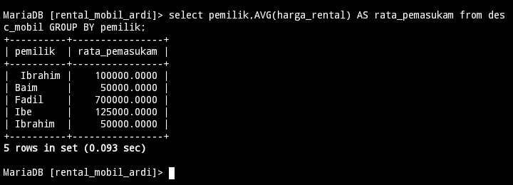

### Analisis 

1. **Fungsi Query:**
   - Mengelompokkan data berdasarkan pemilik dan menghitung rata-rata harga rental mobil untuk setiap pemilik.

2. **Komponen Utama:**
   - `SELECT pemilik`: Memilih kolom pemilik.
   - `AVG(harga_rental) AS rata_pemasukan`: Menghitung rata-rata nilai `harga_rental` untuk setiap pemilik dan memberikan alias hasil sebagai `rata_pemasukan`.
   - `FROM desc_mobil`: Menunjukkan tabel sumber data.
   - `GROUP BY pemilik`: Mengelompokkan hasil berdasarkan pemilik.

3. **Tujuan:**
   - Mengetahui rata-rata pendapatan yang diperoleh dari harga rental mobil untuk setiap pemilik dalam dataset.

### Kesimpulan

Query ini memberikan informasi tentang rata-rata pendapatan yang diperoleh dari harga rental mobil per pemilik, memberikan wawasan tentang performa rata-rata setiap pemilik dalam hal pendapatan dari rental mobil dalam dataset.

## 7. Berdasarkan praktikum 5 no 16 tampilkan pemasukan terbesar dan pemasukan terkecil kelompokkan berdasarkan pemiliknya dan seleksi data pemilik yg tampil atau memiliki jumlah mobil lebih besar dari 1
### Struktur 

```mysql
select nama_kolom,MAX(nama_kolom) AS nama_sementara,MIN(nama_kolom) AS nama_sementara from nama_tabel GROUP BY nama_kolom HAVING COUNT(nama_kolom) > nilai_kolom;
```

### Contoh

```mysql
select pemilik,MAX(harga_rental) AS Pemasukan_Terbesar ,MIN(harga_rental) AS pemasukan_terkecil from desc_mobil GROUP BY pemilik HAVING COUNT(harga_rental) > 1;
```

### Hasil

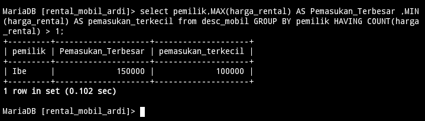

### Analisis 

1. **Fungsi Query:**
   - Mengelompokkan data berdasarkan pemilik.
   - Menghitung nilai maksimum dan minimum dari kolom `harga_rental` untuk setiap pemilik yang memiliki lebih dari satu entri mobil.

2. **Komponen Utama:**
   - `SELECT pemilik`: Memilih kolom `pemilik`.
   - `MAX(harga_rental) AS Pemasukan_Terbesar`: Menghitung nilai maksimum dari harga rental mobil untuk setiap pemilik.
   - `MIN(harga_rental) AS Pemasukan_Terkecil`: Menghitung nilai minimum dari harga rental mobil untuk setiap pemilik.
   - `FROM desc_mobil`: Menunjukkan sumber data dari tabel `desc_mobil`.
   - `GROUP BY pemilik`: Mengelompokkan hasil berdasarkan kolom `pemilik`.
   - `HAVING COUNT(harga_rental) > 1`: Mengaplikasikan kondisi hanya pada pemilik yang memiliki lebih dari satu entri mobil dalam dataset.

3. **Tujuan:**
   - Menemukan pemilik mobil yang memiliki lebih dari satu entri dalam data, dan menampilkan harga rental terbesar dan terkecil untuk setiap pemilik tersebut.

### Kesimpulan

Query ini memberikan wawasan tentang rentang harga rental mobil yang dimiliki oleh setiap pemilik yang memiliki lebih dari satu entri dalam dataset `desc_mobil`. Informasi ini dapat berguna untuk analisis keuangan atau evaluasi performa rental mobil dari masing-masing pemilik.
